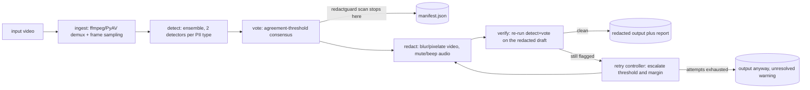
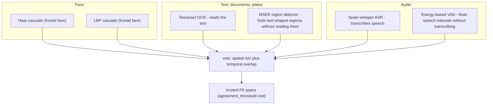
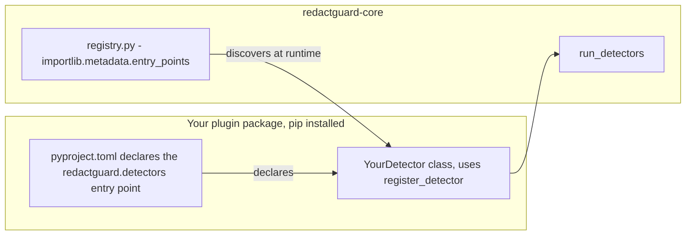

<!-- RedactGuard | Author: Ritesh Ambastha -->

# RedactGuard

**A self-hosted, privacy-preserving video PII redaction toolkit.**

RedactGuard detects and redacts personally identifiable information in
video — faces, on-screen text/documents (including license plates), and
spoken PII in audio — entirely on infrastructure you control. No frame or
transcript ever leaves the machine it runs on.

[](https://github.com/riteshambastha/redactguard/actions/workflows/ci.yml)
[](https://github.com/riteshambastha/redactguard/actions/workflows/docker-build.yml)
[](LICENSE)

## Why RedactGuard is different

- **Ensemble detection.** Every PII type is checked by two independent
  detectors, chosen specifically to fail in *different* ways, that vote on
  agreement rather than trusting a single model's blind spots.
- **Closed-loop verification.** After redaction, RedactGuard re-scans its
  own output with the same detect+vote pass. If anything is still
  flagged, a retry controller escalates settings and re-redacts — up to
  N attempts — before finalizing.
- **Never withholds output.** If verification can't fully resolve a file
  after all retries, RedactGuard still writes it, with a loud
  `unresolved` warning in the audit report for human review. It never
  silently hides a failure, and never silently sits on your data either.
- **Policy-as-code.** Compliance profiles (GDPR, CCPA, or your own) are
  versioned YAML, not hidden thresholds buried in code.
- **Plugin architecture.** New PII detectors register via a small SDK and
  Python entry points — no core changes required, verified against a
  real, separately-packaged example plugin in this repo.
- **Runs entirely offline**, on hardware you own: no frame, transcript, or
  detection result is ever sent to a third-party API.

## How it works



`redactguard scan` runs the pipeline through the vote step only, and
writes a JSON manifest of detected spans without touching the source
video — useful for auditing what *would* be redacted before committing to
it. `redactguard run` (and `redactguard batch` for a whole folder) carries
on through redact → verify → retry → report.

Detection runs once, against the original source. A retry only re-votes
the *same* raw detections at a lower agreement threshold and re-composites
with a wider blur margin — it doesn't re-run the (expensive) detectors
themselves. Only the verification step re-decodes and re-detects, and it
does so against the redacted draft, to confirm nothing was missed.
Redaction is composited at the source's native frame rate even though
detection samples more sparsely (default 1 fps) — detect sparse, redact
dense, so nothing between sampled frames slips through un-redacted.

## Ensemble detection, per PII type

A single detector always has blind spots, and a second detector using the
*same* underlying technique just repeats them. Each PII type here is
covered by two detectors chosen to fail differently, so agreement between
them means something:



Voting requires the same `pii_type`, temporal overlap, and — for anything
that carries a bounding box — spatial overlap above an IoU threshold
(deliberately loose, since two algorithmically different detectors rarely
draw near-identical boxes around the same real thing). A policy's
`agreement_threshold` controls how many independent detectors must agree
before a span is trusted enough to redact.

New PII types plug into the same voting logic automatically — the vote
step doesn't know or care which detectors produced a given
`DetectionResult`, only that enough of them agree.

## Plugin architecture

Third-party detectors ship as independent, pip-installable packages —
`redactguard-core` never imports them directly:



`packages/plugin-sdk/examples/example_tattoo_detector_plugin/` is a real,
separately-packaged, pip-installed distribution — not a design sketch —
proving this end-to-end: `packages/core/tests/test_plugin_discovery.py`
installs it and asserts the entry point is discovered and runs through
`run_detectors()`, the same function `scan`/`run` use for built-in
detectors.

## Repository layout

A monorepo with three installable packages plus policies, docs, and
Docker images:

```
redactguard/
├── packages/
│   ├── core/                    redactguard-core
│   │   └── redactguard_core/
│   │       ├── pipeline/        ingest, policy, orchestrator, manifest, report
│   │       ├── detectors/       face/ text/ audio/ + registry.py (plugin discovery)
│   │       ├── ensemble/        voting.py (agreement + IoU)
│   │       ├── redaction/       visual.py, audio.py, muxer.py
│   │       └── verification/    verifier.py, retry_controller.py
│   ├── cli/                     redactguard-cli  (scan | run | batch)
│   ├── plugin-sdk/              redactguard-plugin-sdk + example_tattoo_detector_plugin/
│   └── webapp/                  redactguard-webapp - signup/login/upload demo UI over core
├── policies/                     gdpr_v1.yaml, ccpa_v1.yaml, custom_template.yaml, ...
├── docker/                       Dockerfile (CPU), Dockerfile.gpu, Dockerfile.webapp, smoke_test.sh
├── docs/adr/                     one markdown file per non-obvious design decision
├── synthetic/                    synthetic test-clip generator (no real PII needed to test)
└── benchmarks/                   benchmark harness
```

## Quickstart

```bash
git clone https://github.com/riteshambastha/redactguard.git
cd redactguard
make install     # pip install -e each package + dev deps

# Dry run - see what would be redacted, without touching the video
redactguard scan input.mp4 --policy policies/gdpr_v1.yaml --out manifest.json

# Redact, verify, retry-if-needed, write output + audit report
redactguard run input.mp4 --policy policies/gdpr_v1.yaml --out redacted.mp4

# Whole folder at once
redactguard batch ./raw_videos --policy policies/gdpr_v1.yaml --out-dir ./redacted
```

Or via Docker, with no local Python/ffmpeg/tesseract setup at all:

```bash
docker build -f docker/Dockerfile -t redactguard:cpu .
docker run --rm -v "$PWD":/data redactguard:cpu \
    run /data/input.mp4 --policy policies/gdpr_v1.yaml --out /data/redacted.mp4
```

An optional `docker/Dockerfile.gpu` image exists for faster Whisper
transcription on real workloads — see its own comments and
[`docs/adr/0010`](docs/adr/0010-docker-image-hardening-and-gpu-device-wiring.md)
for the `REDACTGUARD_WHISPER_DEVICE=cuda` env var and its cuDNN caveat.

## Try it in a browser

`packages/webapp` is a small, self-contained FastAPI app that puts a real
UI in front of the pipeline: sign up, log in, upload a video, and watch
detection → redaction → verification → retry run against it, with the
audit report and a download link for the result:

```bash
pip install -e packages/core -e packages/webapp
redactguard-webapp
# -> http://127.0.0.1:8000
```

Or via Docker:

```bash
docker build -f docker/Dockerfile.webapp -t redactguard:webapp .
docker run --rm -p 8000:8000 -v redactguard_data:/data redactguard:webapp
```

See [`packages/webapp/README.md`](packages/webapp/README.md) for
configuration and its explicit security notes — it's a demo/reference
app, not hardened for multi-tenant production use.

## Policy profiles

Compliance behavior is versioned YAML, not a hidden threshold in code:

```yaml
# policies/gdpr_v1.yaml
pii_types:
  face:
    enabled: true
  text:
    enabled: true
  audio:
    enabled: true

agreement_threshold: 2     # detectors that must agree before a span is trusted
custom_keywords: []        # org-specific terms to redact wherever found

retry:
  max_attempts: 3
  escalation: "lower_threshold_and_widen_margin"
  on_unresolved: "warn"    # emit output + audit warning, never hard-fail
```

See [`policies/`](policies/) for the shipped GDPR/CCPA profiles and a
blank `custom_template.yaml` to start your own.

## Design decisions

Every non-obvious choice in this codebase has a corresponding
Architecture Decision Record — read these before assuming something was
an accident:

| ADR | Decision |
|---|---|
| [0001](docs/adr/0001-ensemble-voting-for-detection.md) | Ensemble voting for detection, not a single model |
| [0002](docs/adr/0002-mandatory-verify-then-retry-loop.md) | Mandatory verify-then-retry loop; never withhold output |
| [0003](docs/adr/0003-policy-profiles-as-versioned-config.md) | Policy profiles as versioned config, not hidden thresholds |
| [0004](docs/adr/0004-plugin-registry-for-detectors.md) | Plugin registry for detectors via entry points |
| [0005](docs/adr/0005-apache2-license-permissive-deps.md) | Apache 2.0 license, permissive dependencies only |
| [0006](docs/adr/0006-haar-cascade-for-walking-skeleton-face-detector.md) | Haar cascade for the walking-skeleton face detector |
| [0007](docs/adr/0007-redaction-compositing-at-native-frame-rate.md) | Redaction compositing at native frame rate, detection sampled sparser |
| [0008](docs/adr/0008-second-independent-detector-per-pii-type.md) | A second, differently-failing detector per PII type |
| [0009](docs/adr/0009-validate-plugin-architecture-with-a-real-example-plugin.md) | Validating the plugin architecture with a real, installed example plugin |
| [0010](docs/adr/0010-docker-image-hardening-and-gpu-device-wiring.md) | Docker image hardening and GPU device wiring |
| [0011](docs/adr/0011-a-server-rendered-demo-webapp-over-core.md) | A server-rendered demo web app over core, not a JSON API + SPA |
| [0012](docs/adr/0012-pipeline-progress-reporting.md) | Pipeline stage progress reporting via logging + an optional callback |
| [0013](docs/adr/0013-clearer-policy-choices-and-webapp-visual-design.md) | Curated policy display copy and a webapp visual design pass |
| [0014](docs/adr/0014-temp-directory-cleanup-and-clean-media-errors.md) | Clean up pipeline temp directories, and raise a clean error for unreadable media |
| [0015](docs/adr/0015-marketing-landing-page-at-root.md) | A real marketing landing page at "/", not a redirect straight to /login |

## Status

The core pipeline (ingest → detect → vote → redact → verify → retry →
report) is implemented and covered end-to-end by tests, including a real
two-detector ensemble per PII type and a real out-of-tree plugin. Docker
images build for CPU, an optional GPU-accelerated variant, and the demo
web app; CI builds and smoke-tests the CPU and webapp images on every
push. The web app itself (signup, login, upload, background job
processing, download) is tested end-to-end against the real pipeline,
not a mocked one.

Not yet production-hardened: detector accuracy is walking-skeleton-grade
(Haar/LBP cascades and classical CV rather than trained deep models), and
the GPU image's cuDNN requirement is documented but unverified in CI (see
ADR-0010). Treat this as a strong architectural foundation and a real,
working reference implementation — not a drop-in production redaction
service yet.

## Development

```bash
make install      # install all packages + dev deps (editable)
make test         # pytest across core, cli, and the example plugin
make lint         # ruff check
make typecheck    # mypy over redactguard_core
make synth-data   # generate synthetic test clips (no real PII needed)
make docker       # build the CPU image locally
```

## License

Apache 2.0 — see [`LICENSE`](LICENSE) and [`NOTICE`](NOTICE).

## Maintainer

Ritesh Ambastha ([@riteshambastha](https://github.com/riteshambastha))

---
*RedactGuard — maintained by Ritesh Ambastha ([@riteshambastha](https://github.com/riteshambastha))*
